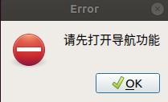
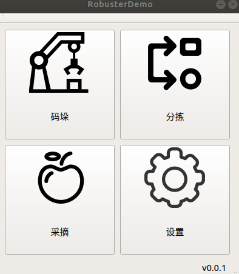
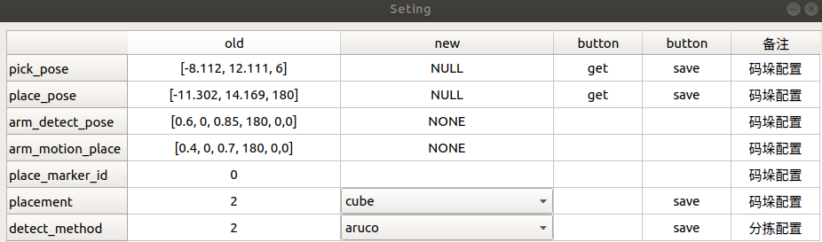

# 依赖
- [yaml-cpp](https://git.robotplusplus.com.cn/third-party/yaml-cpp.git)
# 注意事项
- ```分拣```与```采摘```需要使用夹爪，```码垛```需要使用真空吸头！！！！
- 使用错误将会产生不可预料后果！！！
- ```分拣```、```采摘```、```码垛```，切换时需要关闭运行程序时的终端。
- 切换功能时建议遥控器先拨至遥控状态
# 使用说明
##  打开
首先需要打开robuster机器人的导航功能


否则会提示



## 主界面

- 码垛：点击```码垛```后将会检查导航服务是否存在，若存在则会启动```码垛功能```
- 分拣：点击```分拣```后将会检查导航服务是否存在，若存在则会启动```分拣功能```
- 采摘：点击```采摘```后将会检查导航服务是否存在，若存在则会启动```采摘功能```
- 设置：点击```设置```可查看或修改部分参数
- 
### 设置


```old栏```为从配置文件中读取的数据。

```new栏```为预保存数据。

```button栏```为可点击按钮。

-  get：获取```base_link```相对于```map```的坐标，在```new栏```中展示
-  save：保存```new栏```中的数据
-  备注：备注栏目，```get```或```save```后，```备注栏```会给出对应提示

